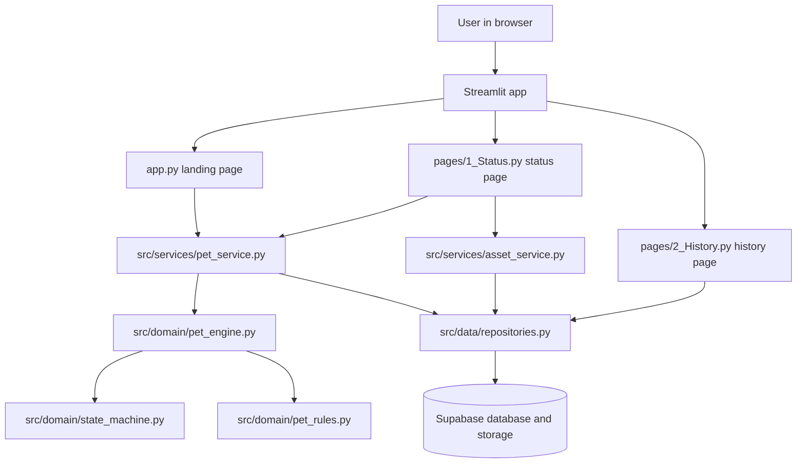

# Tiny Tamagotchi MVP

A small Streamlit and Supabase pet-care demo. The app intentionally stays narrow: one active pet, three stats, three actions, and three functional states.

The current MVP includes:

- One persisted pet record using the fixed id `active-pet`.
- Three stats: `hunger`, `happiness`, and `energy`.
- Three actions: `Feed`, `Play`, and `Rest`.
- Three states: `normal`, `sick`, and `evolved`.
- Deterministic time reconstruction from `last_tick_at`.
- Supabase persistence for pet state and event history.
- Supabase Storage-backed image rendering through metadata rows.
- A Streamlit landing page, status page, history page, and about page.
- Pytest coverage for pet engine rules, state transitions, asset selection, and persistence behavior.

This project deliberately does not include auth, inventory, currencies, notifications, or mini-games.

## Image Placeholders

Add screenshots to these locations when you want the README to show the database and architecture visually.

Database/schema screenshot placeholder:


App/backend/frontend flow placeholder:


Recommended screenshots:

- Supabase table relationship view showing `pets`, `pet_events`, `pet_assets`, and `background_assets`.
- Supabase Storage bucket view showing uploaded pet sprites and background images.
- Running Streamlit app status page with a pet sprite over a background scene.
- Optional architecture diagram showing Streamlit pages, service layer, domain engine, repositories, and Supabase.

## How The App Works

The app is split so that Streamlit pages render UI while the domain and service layers handle behavior.



Request flow for the status page:

1. Streamlit loads `pages/1_Status.py`.
2. `build_supabase_repository()` creates a repository backed by the Supabase client.
3. `load_active_pet()` fetches the one active pet from `pets`.
4. The service calls `apply_elapsed_time()` to reconstruct missed ticks from `last_tick_at`.
5. If ticks were applied, the updated pet is saved back to Supabase and transition events are appended.
6. `load_scene_assets()` selects the correct pet sprite and background image for the current pet state.
7. The Streamlit page renders the Tamagotchi device frame, image scene, stats, and action buttons.
8. When the user clicks Feed, Play, or Rest, `care_for_pet()` applies elapsed decay first, applies the action, evaluates transitions, saves the pet, and appends events.

## Current User Experience

### Landing Page

`app.py` is the landing page.

It:

- Loads the evolved pet sprite from Supabase for the landing mascot when available.
- Shows a pet name input.
- Starts the game when the user submits the form.
- Creates a new active pet if none exists.
- Resets the active pet if the user enters a different name than the saved pet.
- Keeps the existing active pet if the submitted name matches.

Important implementation detail:

- There is only one pet slot.
- The persisted id is always `active-pet`.
- Creating a new name replaces the old demo pet and clears its old event history.

### Status Page

`pages/1_Status.py` is the main game screen.

It:

- Auto-refreshes the live pet fragment every `30` seconds.
- Loads the active pet.
- Applies deterministic elapsed time decay.
- Loads pet and background image assets from Supabase.
- Renders the existing pink Tamagotchi-style device frame.
- Places the pet sprite over the selected background image.
- Shows a comic-style speech bubble.
- Shows state, hunger, happiness, and energy bars.
- Provides Feed, Play, and Rest buttons.
- Keeps a normal-state day/night selector when the night background exists.

If Supabase images are missing or cannot be loaded, the page warns the user and falls back to the CSS placeholder scene instead of crashing.

### History Page

`pages/2_History.py` shows recent persisted events for the active pet.

It reads from `pet_events` through the repository and renders the latest entries.

### About Page

`pages/3_About.py` briefly describes the MVP.

## Simulation Rules

All simulation logic belongs in `src/domain` and `src/services`, not directly in Streamlit pages.

Core files:

- `src/domain/pet_types.py`: immutable domain models and enums.
- `src/domain/pet_rules.py`: constants for stats, ticks, actions, thresholds, and messages.
- `src/domain/pet_engine.py`: pet creation, stat changes, action application, elapsed time reconstruction, and state messages.
- `src/domain/state_machine.py`: normal, sick, evolved, recovery, and evolution transitions.
- `src/services/pet_service.py`: orchestration around repository reads/writes and engine calls.
- `src/services/asset_service.py`: pure image asset selection rules.

### Stats

Each pet has exactly three stats:

- `hunger`
- `happiness`
- `energy`

Stats are clamped between `0` and `100`.

New pets start with:

```text
hunger = 80
happiness = 80
energy = 80
```

### Time Decay

The app reconstructs time deterministically from `last_tick_at`.

Current demo settings:

```text
tick duration = 30 seconds
hunger decay per tick = -10
happiness decay per tick = -8
energy decay per tick = -4
max offline catch-up ticks = 72
```

Example:

- If `last_tick_at` is 12:00:00 and the app loads at 12:01:10, the engine applies two full 30-second ticks.
- The extra 10 seconds are preserved by advancing `last_tick_at` only to 12:01:00.
- On the next load, the leftover time still counts toward the next full tick.

This is why the app does not need background workers for the MVP.

### Actions

The app supports exactly three care actions.

```text
Feed:
  hunger +18
  happiness +4
  energy +0

Play:
  hunger -4
  happiness +16
  energy -8

Rest:
  hunger -2
  happiness -3
  energy +20
```

Before an action is applied, `care_for_pet()` applies elapsed time first. That keeps button clicks honest if the app has been sitting open.

### State Transitions

Supported states:

- `normal`
- `sick`
- `evolved`

Current sickness rule:

```text
If any one of hunger, happiness, or energy drops below 15, the pet becomes sick on the next engine evaluation.
```

This can happen after:

- an elapsed time tick
- a care action that drops a stat below the threshold

Recovery rule:

```text
A sick pet recovers after 2 consecutive evaluations where all three stats are at least 40.
```

Evolution rule:

```text
A non-sick pet evolves when:
  age_ticks >= 12
  hunger >= 70
  happiness >= 70
  energy >= 70
  care_action_count >= 6
```

Evolution is permanent through the `is_evolved` flag. If an evolved pet becomes sick, it can recover back to `evolved`.

If sickness and evolution are both possible during the same evaluation, sickness wins.

### Messages

The speech bubble uses two kinds of messages:

- One-time action/start messages stored briefly in Streamlit session state.
- Rotating state messages generated by `state_message()` in `src/domain/pet_engine.py`.

The state messages are deterministic instead of using Python's global random module. That keeps the behavior easy to test with pytest.

## Supabase Backend

The app uses Supabase for:

- `pets`: the single active pet row.
- `pet_events`: action and transition history.
- `pet_assets`: metadata for pet sprite images.
- `background_assets`: metadata for background scene images.
- Supabase Storage: the actual PNG files.

The Streamlit app uses the Supabase anon key from Streamlit secrets or environment variables.

## Required Supabase Tables

The project expects these four tables.

### `pets`

```sql
create table if not exists pets (
    id text primary key,
    name text not null check (char_length(name) between 1 and 20),
    state text not null check (state in ('normal', 'sick', 'evolved')),
    hunger integer not null check (hunger between 0 and 100),
    happiness integer not null check (happiness between 0 and 100),
    energy integer not null check (energy between 0 and 100),
    age_ticks integer not null default 0 check (age_ticks >= 0),
    is_evolved boolean not null default false,
    evolved_at timestamptz,
    last_tick_at timestamptz not null,
    created_at timestamptz not null,
    updated_at timestamptz not null,
    sick_streak integer not null default 0 check (sick_streak >= 0),
    recovery_streak integer not null default 0 check (recovery_streak >= 0),
    care_action_count integer not null default 0 check (care_action_count >= 0)
);
```

### `pet_events`

```sql
create table if not exists pet_events (
    id bigint generated by default as identity primary key,
    pet_id text not null references pets(id) on delete cascade,
    event_type text not null check (
        event_type in (
            'action',
            'became_sick',
            'recovered',
            'evolved',
            'time_anomaly'
        )
    ),
    event_message text not null,
    action text check (action in ('feed', 'play', 'rest') or action is null),
    payload_json jsonb not null default '{}'::jsonb,
    created_at timestamptz not null
);

create index if not exists pet_events_pet_created_idx
    on pet_events (pet_id, created_at desc);
```

### `pet_assets`

```sql
create table if not exists pet_assets (
    id bigint generated by default as identity primary key,
    asset_key text not null,
    state text not null check (state in ('normal', 'sick', 'evolved')),
    file_path text,
    public_url text,
    width integer,
    height integer,
    is_active boolean not null default true,
    created_at timestamptz not null default now()
);

create index if not exists pet_assets_state_active_idx
    on pet_assets (state, is_active);
```

### `background_assets`

```sql
create table if not exists background_assets (
    id bigint generated by default as identity primary key,
    asset_key text not null,
    scene_type text not null,
    file_path text,
    public_url text,
    width integer,
    height integer,
    is_active boolean not null default true,
    created_at timestamptz not null default now()
);

create index if not exists background_assets_scene_active_idx
    on background_assets (scene_type, is_active);
create index if not exists background_assets_key_active_idx
    on background_assets (asset_key, is_active);
```

## Supabase Row Level Security

The app has no auth in this MVP. For a simple demo, the anon role must be able to read and write the one active pet, insert/read events for that pet, and read active asset metadata.

Use policies like these if RLS is enabled.

```sql
alter table pets enable row level security;
alter table pet_events enable row level security;
alter table pet_assets enable row level security;
alter table background_assets enable row level security;

drop policy if exists "Allow anonymous read of active pet" on pets;
drop policy if exists "Allow anonymous insert of active pet" on pets;
drop policy if exists "Allow anonymous update of active pet" on pets;
drop policy if exists "Allow anonymous read of pet events" on pet_events;
drop policy if exists "Allow anonymous insert of pet events" on pet_events;
drop policy if exists "Allow anonymous delete of active pet events" on pet_events;
drop policy if exists "Allow anonymous read of active pet assets" on pet_assets;
drop policy if exists "Allow anonymous read of active background assets" on background_assets;

create policy "Allow anonymous read of active pet"
on pets
for select
to anon
using (id = 'active-pet');

create policy "Allow anonymous insert of active pet"
on pets
for insert
to anon
with check (id = 'active-pet');

create policy "Allow anonymous update of active pet"
on pets
for update
to anon
using (id = 'active-pet')
with check (id = 'active-pet');

create policy "Allow anonymous read of pet events"
on pet_events
for select
to anon
using (pet_id = 'active-pet');

create policy "Allow anonymous insert of pet events"
on pet_events
for insert
to anon
with check (pet_id = 'active-pet');

create policy "Allow anonymous delete of active pet events"
on pet_events
for delete
to anon
using (pet_id = 'active-pet');

create policy "Allow anonymous read of active pet assets"
on pet_assets
for select
to anon
using (is_active = true);

create policy "Allow anonymous read of active background assets"
on background_assets
for select
to anon
using (is_active = true);
```

For local demos, you can also use the service role key in Streamlit secrets, but do not commit that key.

## Supabase Storage Assets

The app expects image metadata rows to point to uploaded PNG files.

Existing expected pet sprites:

```text
normal_pet.png
sick_pet.png
evolved_pet.png
```

Existing expected backgrounds:

```text
daytime_scene.png
night_scene.png
evolved_scene.png
```

Recommended dimensions:

- Backgrounds: `1024 x 576` or any consistent `16:9` size.
- Pet sprites: transparent PNGs around `256 x 256` or `512 x 512`.
- Keep all backgrounds the same aspect ratio so the status screen does not jump between states.

The status page reads `width` and `height` from `background_assets` and uses that ratio for the scene window. This prevents blue padding around the background when metadata matches the actual image dimensions.

## Asset Metadata

The app does not search Storage directly by filename. It reads rows from `pet_assets` and `background_assets`.

Pet asset lookup:

- Repository method: `fetch_active_pet_asset(state)`
- Table: `pet_assets`
- Filters:
  - `state = pet.state.value`
  - `is_active = true`

Background lookup:

- Repository method: `fetch_active_background_asset(scene_type)`
- Table: `background_assets`
- Filters:
  - first tries `scene_type = selected_scene_type`
  - then falls back to `asset_key = selected_scene_type`
  - always requires `is_active = true`

URL resolution happens in `asset_from_record()` in `src/data/repositories.py`.

Resolution order:

1. Use `public_url` if it exists.
2. If `file_path` is already an `http://` or `https://` URL, use it.
3. If `file_path` looks like `bucket/object-path`, ask the Supabase Storage client for a public URL.
4. If none of those work, the asset is treated as missing and the UI falls back to the placeholder scene.

Recommended metadata rows:

```sql
insert into pet_assets (
    asset_key,
    state,
    file_path,
    public_url,
    width,
    height,
    is_active
) values
    ('normal_pet', 'normal', 'pet-assets/normal_pet.png', null, 512, 512, true),
    ('sick_pet', 'sick', 'pet-assets/sick_pet.png', null, 512, 512, true),
    ('evolved_pet', 'evolved', 'pet-assets/evolved_pet.png', null, 512, 512, true);

insert into background_assets (
    asset_key,
    scene_type,
    file_path,
    public_url,
    width,
    height,
    is_active
) values
    ('daytime_scene', 'daytime_scene', 'background-assets/daytime_scene.png', null, 1024, 576, true),
    ('night_scene', 'night_scene', 'background-assets/night_scene.png', null, 1024, 576, true),
    ('evolved_scene', 'evolved_scene', 'background-assets/evolved_scene.png', null, 1024, 576, true);
```

Adjust `file_path` to match your real bucket names. The examples above assume two public buckets:

- `pet-assets`
- `background-assets`

If you paste full public URLs into `public_url`, the bucket/object `file_path` can still be kept for traceability.

## Asset Selection Rules

The state-to-asset rules live in `src/services/asset_service.py`.

Pet sprite mapping:

```text
normal -> normal_pet
sick -> sick_pet
evolved -> evolved_pet
```

Background mapping:

```text
normal default -> daytime_scene
normal with night selector -> night_scene, only when night_scene exists
sick -> night_scene
evolved -> evolved_scene
```

If a selected scene is incompatible with the pet state, the app overrides it gracefully:

- Sick always uses the night scene.
- Evolved always uses the evolved scene.
- Normal uses day by default.

## Local Setup

Create and activate a virtual environment:

```powershell
python -m venv .venv
.\.venv\Scripts\Activate.ps1
```

Install dependencies:

```powershell
python -m pip install -r requirements.txt
```

Create `.streamlit/secrets.toml`:

```toml
SUPABASE_URL = "https://your-project.supabase.co"
SUPABASE_KEY = "your-anon-or-service-role-key"
```

Alternative nested format supported by the app:

```toml
[supabase]
url = "https://your-project.supabase.co"
anon_key = "your-anon-key"
```

Run the app:

```powershell
streamlit run app.py
```

Run tests:

```powershell
python -m pytest
```

Compile-check Python files:

```powershell
python -m compileall app.py pages src
```

## Project Structure

```text
app.py
pages/
  1_Status.py
  2_History.py
  3_About.py
src/
  data/
    repositories.py
    supabase_client.py
  domain/
    pet_types.py
    pet_rules.py
    pet_engine.py
    state_machine.py
  services/
    asset_service.py
    persistence_service.py
    pet_service.py
    tick_service.py
  ui/
    components.py
    styles.py
    theme.py
tests/
  integration/
    test_persistence.py
  smoke/
    test_basic_flow.py
  unit/
    test_asset_selection.py
    test_pet_engine.py
    test_state_machine.py
persistence/
  schema.sql
  policies.sql
```

## File Responsibilities

### Streamlit Pages

`app.py`

- Landing page.
- Pet name form.
- Loads evolved pet mascot if available.
- Creates, resets, or resumes the one active pet.

`pages/1_Status.py`

- Renders the main game UI.
- Calls services for pet loading, actions, and asset selection.
- Uses `st.fragment(run_every="30s")` through the domain tick duration.
- Does not own pet simulation rules.

`pages/2_History.py`

- Loads active pet.
- Reads recent events.
- Renders event history.

`pages/3_About.py`

- Small explanatory page.

### Domain Layer

`src/domain/pet_types.py`

- `PetState`
- `PetAction`
- `EventType`
- `StatBlock`
- `StatDelta`
- `Pet`
- `PetEvent`
- result dataclasses

`src/domain/pet_rules.py`

- Supported states and actions.
- Stat bounds.
- Default stats.
- Tick duration and decay.
- Action effects.
- Sickness, recovery, and evolution thresholds.
- Action and state messages.

`src/domain/pet_engine.py`

- Creates pets.
- Validates pet names.
- Clamps stats.
- Applies action deltas.
- Applies elapsed ticks from `last_tick_at`.
- Emits action and time anomaly events.
- Generates deterministic rotating state messages.

`src/domain/state_machine.py`

- Checks sickness.
- Checks recovery.
- Checks evolution.
- Emits transition events.
- Prioritizes sickness before recovery/evolution where appropriate.

### Service Layer

`src/services/pet_service.py`

- Loads the active pet.
- Applies elapsed time before returning a pet.
- Creates/reset the active pet.
- Applies elapsed time before actions.
- Saves pets and appends events.

`src/services/asset_service.py`

- Selects asset keys from pet state and selected scene mode.
- Loads resolved image URLs through the repository.
- Reports missing assets for UI fallback.

`src/services/persistence_service.py`

- Builds the Supabase-backed repository.

### Data Layer

`src/data/supabase_client.py`

- Reads Supabase secrets.
- Configures SSL certificate paths.
- Creates the Supabase Python client.

`src/data/repositories.py`

- Defines the repository protocol.
- Implements Supabase reads/writes.
- Implements in-memory repository for tests.
- Converts Supabase records to domain objects.
- Converts domain objects to Supabase records.
- Resolves image URLs from metadata rows.

## Testing

The test suite keeps the engine and persistence behavior easy to verify.

Current coverage areas:

- Pet creation defaults and validation.
- Action stat changes.
- Deterministic action message variety.
- Elapsed time reconstruction.
- Offline catch-up cap.
- Future timestamp safety.
- Sickness transition when any stat drops below `15`.
- Recovery after two good evaluations.
- Evolution rules.
- Sick state blocking evolution.
- Asset selection by pet state.
- Background override rules.
- Missing asset fallback behavior.
- Pet and event record serialization.
- Supabase timestamp parsing.
- Persistence service action flow.

Run:

```powershell
python -m pytest
```

Expected current result:

```text
38 passed
```

## Troubleshooting

### `Supabase is not configured`

Add credentials to `.streamlit/secrets.toml`:

```toml
SUPABASE_URL = "https://your-project.supabase.co"
SUPABASE_KEY = "your-key"
```

### `Could not load pet from Supabase`

Check:

- The `pets` table exists.
- RLS policies allow the current key to select `id = 'active-pet'`.
- The app is using the right Supabase project URL and key.
- Your local network can reach Supabase.

### `Could not save pet to Supabase`

Check:

- The `pets` table has all required columns.
- RLS policies allow insert and update for `id = 'active-pet'`.
- The key in Streamlit secrets has enough permission.

### `Could not append pet events to Supabase`

Check:

- The `pet_events` table exists.
- The `pet_id` foreign key points to an existing `pets.id`.
- RLS policies allow insert for `pet_id = 'active-pet'`.

### `Missing active image asset(s): daytime_scene`

Check:

- A row exists in `background_assets`.
- `scene_type` or `asset_key` is exactly `daytime_scene`.
- `is_active` is `true`.
- `public_url` is valid, or `file_path` has the format `bucket/object-path`.
- The Storage bucket/object is public if using generated public URLs.

### Pet image does not load

Check:

- `pet_assets.state` is exactly one of `normal`, `sick`, or `evolved`.
- `pet_assets.asset_key` is one of `normal_pet`, `sick_pet`, or `evolved_pet`.
- `is_active` is `true`.
- The image URL opens directly in a browser.

### Blue space around the background

Check:

- The `width` and `height` metadata match the real background image.
- All backgrounds use the same aspect ratio.
- Recommended background size is `1024 x 576`.

### SSL certificate errors on Windows

The app configures certificate paths in `src/data/supabase_client.py`.

Dependencies include:

- `certifi`
- `truststore` on Python 3.10+
- `python-certifi-win32` on Windows with Python below 3.10

If SSL still fails, you can provide a custom CA bundle path in secrets:

```toml
SUPABASE_CA_BUNDLE = "C:\\path\\to\\company-ca-bundle.pem"
```

### Pet name keeps showing an old pet

There is only one pet slot with id `active-pet`.

On the landing page:

- Submit the same name to continue.
- Submit a different name to reset the active pet and clear old events.

## Design Constraints

This MVP intentionally keeps scope tight:

- No auth.
- No inventory.
- No currencies.
- No notifications.
- No mini-games.
- No multiple pets.
- No pet logic directly in Streamlit pages.
- No background worker requirement.

That keeps the app easy to reason about and easy to test.
